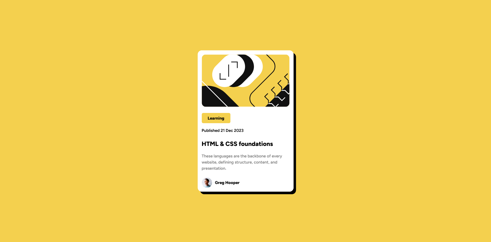

# Frontend Mentor - Blog preview card solution

This is a solution to the [Blog preview card challenge on Frontend Mentor](https://www.frontendmentor.io/challenges/blog-preview-card-ckPaj01IcS). Frontend Mentor challenges help you improve your coding skills by building realistic projects. 

## Table of contents

- [Overview](#overview)
  - [The challenge](#the-challenge)
  - [Screenshot](#screenshot)
  - [Links](#links)
- [My process](#my-process)
  - [Built with](#built-with)
  - [Useful resources](#useful-resources)
- [Author](#author)

## Overview

### The challenge

Users should be able to:

- See hover and focus states for all interactive elements on the page

### Screenshot

### Links

- Solution URL: [Github Repo](https://github.com/awesooomeME/blog_preview_card)
- Live Site URL: [Live Site](https://blog-preview-card-ten.vercel.app/)
- Fronentmentor Solution URL: [Solution](https://www.frontendmentor.io/solutions/blog-preview-card-with-nextjs-VYW2fRiZ_x)

## My process

### Built with

- Semantic HTML5 markup
- CSS custom properties
- Flexbox
- CSS Grid
- Mobile-first workflow
- [React](https://reactjs.org/) - JS library
- [Next.js](https://nextjs.org/) - React framework
- [tailwind](https://tailwindcss.com/) - For styles

### Useful resources

- [CSS Reset](https://www.joshwcomeau.com/css/custom-css-reset/) - This article explains the css reset that I used for this project.

## Author

- Frontend Mentor - [@awesooomeME](https://www.frontendmentor.io/profile/awesooomeME)
- Github - [@awesooomeME](https://github.com/awesooomeME)